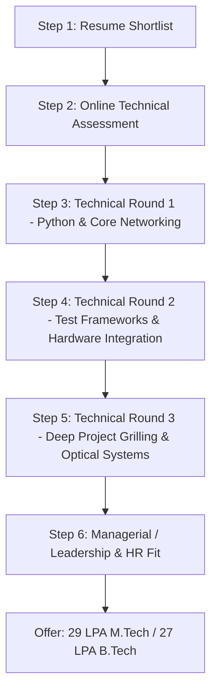

# 00: START HERE — Lumilens Master Guide & Strategic Playbook

> **Role:** Software Test Automation Engineer (Early Talent / Optical Product Test)  
> **Company:** Lumilens Inc. (Emerged from stealth Aug 2026 | $900M+ funding | $5.5B valuation)  
> **Hiring Context:** On-Campus Drive @ NIT Rourkela (Batch 2027)  
> **Compensation (CTC):** M.Tech: **29 LPA** | B.Tech: **27 LPA** | Ph.D.: **33 LPA**  
> **Candidate Profile:** Adarsh Saurabh (M.Tech Signal & Image Processing, NIT Rourkela | B.Tech CSE)

---

## 1. Executive Summary: What Lumilens Actually Is

Lumilens is not a conventional SaaS or cloud networking company. It is a **deep-tech AI infrastructure and silicon photonics powerhouse**.

### The Core Problem Lumilens Solves: "The Copper Wall"
Modern generative AI clusters (thousands to hundreds of thousands of GPUs like NVIDIA H100, B200, and custom ASICs) are limited by **interconnect bandwidth, latency, power, and physical reach**:
- **The Physical Limit of Copper:** At modern lane speeds (100 Gbps and 200 Gbps per lane, PCIe Gen 6/7, 800G/1.6T Ethernet), traditional electrical copper cables (Direct Attach Copper / DAC) experience extreme attenuation. High-frequency electrical signals can only travel **1 to 2 meters** before signal degradation (insertion loss and inter-symbol interference) makes transmission impossible without bulky, power-hungry retimers.
- **The Scale Problem:** A hyperscale AI training cluster cannot fit inside a single 2-meter rack. Tens of thousands of GPUs spread across hundreds of server racks.
- **Power & Thermal Crisis:** Up to 20%–30% of total data center power is wasted simply pushing electrons across copper wires and cooling the resulting heat.
- **The Optical Solution:** Light has virtually zero frequency-dependent attenuation over data center distances, generates zero heat along the fiber, and allows massive wavelength division multiplexing (WDM).
- **Lumilens Technology:** Lumilens designs **Silicon Photonics (SiPh)** engines, optical transceivers, Near-Package Optics (NPO), and Co-Packaged Optics (CPO) to connect GPU-to-GPU and switch-to-switch with optical interconnects.

```
[ Traditional Server Rack ]                 [ Lumilens Next-Gen Optical Fabric ]
  GPU --[Copper DAC < 2m]--> Switch           GPU --[Co-Packaged Optical Engine]--> Fiber
  * Extreme heat & power                     * 50%-80% lower power consumption
  * Massive cable thickness                  * 10x-100x distance reach (> 100m)
  * Distance bottleneck blocks scale         * Massive multi-terabit bandwidth density
```

### Key Business & Technical Signals
- **Founding & Leadership:** Founded in 2024 by networking and systems veterans (CEO Ankur Singla, previously founder of Contrail Systems [acquired by Juniper] and Volterra [acquired by F5]).
- **Funding & Backing:** Over **$900 Million** raised from top-tier institutional and strategic investors; valued at **$5.5 Billion**.
- **Execution State:** Emerged from stealth in August 2026 after landing multi-billion-dollar commercial supply agreements with tier-1 AI hyperscalers.

---

## 2. Job Profile: Software Test Automation Engineer (Optical Product Test)

This role bridges **software automation**, **Layer 1/Layer 2 networking protocols**, and **optical/physical hardware instruments**.

### Core Responsibilities Extracted from Official JD
1. **Python-Based Test Frameworks:** Architect, implement, and maintain automated regression, functional, and stress test suites in Python.
2. **Protocol Validation (L1 / L2):** Validate Ethernet framing, MAC learning, MTU, packet drop rates, Bit Error Rate (BER), and throughput over optical links and network switches.
3. **Hardware-in-the-Loop (HIL) & Traffic Generation:** Program and control high-speed traffic generators (e.g., **IXIA**, Spirent) to simulate multi-terabit network traffic and stress DUTs (Devices Under Test).
4. **Lab Instrument Automation:** Automate optical power meters, optical spectrum analyzers, variable optical attenuators (VOA), and oscilloscopes using **SCPI (Standard Commands for Programmable Instruments)** over **NI-VISA**, RS-232, and TCP/IP sockets.
5. **Manufacturing Test & Yield Optimization:** Develop production-line test scripts for high-volume manufacturing (HVM) of silicon photonics transceivers, log telemetry into SQL/NoSQL databases, and manage change control.
6. **CI/CD Integration:** Integrate hardware test benches into continuous integration pipelines via Jenkins, ArgoCD, and shell automation.

---

## 3. The Selection Process & Round Breakdown



### Stage 1: Resume Shortlist (Cleared)
- Candidate matches dual criteria: B.Tech CSE (strong software/algorithms foundation) + M.Tech Signal and Image Processing at NIT Rourkela (mathematics, signal properties, noise, filtering).

### Stage 2: Online Technical Assessment (60–90 Minutes)
- **Section A: Data Structures & Python Coding (2–3 Problems):**
  - Parsing and stateful stream processing (e.g., parsing raw packet dumps, bit manipulation, sliding window rate limits).
  - Graph/routing or hash map optimization (similar to A* pathfinding or MAC address lookup).
- **Section B: Networking MCQs & Short Technical Questions (15–20 Questions):**
  - OSI Layer 1 vs Layer 2: Ethernet frame structure, preamble, SFD, FCS/CRC-32, MAC addressing, MTU, VLAN 802.1Q.
  - Signal integrity & optics basics: Bit Error Rate (BER), dBm to mW conversion, PRBS patterns, eye diagrams.
- **Section C: Linux, Shell & Scripting (5–10 Questions):**
  - Regex for log parsing, bash automation, socket states (`netstat`, `ss`, `tcpdump`).

### Stage 3: Technical Round 1 — Python, DSA & Networking Protocols (45–60 Mins)
- Live coding of a test automation helper (e.g., a packet loss analyzer or custom parser).
- In-depth grilling on Python internals: generators, decorators, memory management, pytest fixture scopes.
- Deep dive into Layer 1 and Layer 2:
  - What happens when a frame is corrupted at the physical layer?
  - How does a switch learn MAC addresses? What happens when the MAC table overflows?
  - What is the difference between Bit Error Rate (BER) and Packet Error Rate (PER)?

### Stage 4: Technical Round 2 — Test Automation Architecture & Instrument Control (45–60 Mins)
- "Design a test automation framework from scratch to validate an 800G optical transceiver."
- Hardware-software communication protocols: How does SCPI work? How do you send commands over NI-VISA / TCP/IP?
- Flaky tests & hardware synchronization: How do you handle an instrument that takes 500ms to stabilize after changing optical laser power? (Avoid `time.sleep()`, use polling with exponential backoff).
- Traffic generation: How would you configure an IXIA chassis to detect dropped packets under burst traffic?

### Stage 5: Technical Round 3 — Candidate Projects & Hardware Grilling (45–60 Mins)
- **PathMapper (IBYD Technology):** A* algorithm, Manhattan heuristic, 10,000 nodes scaling. How does this relate to packet routing in an optical CLOS network fabric?
- **Uplan Document Verification Pipeline:** Multi-agent pipeline, rule-based verification, regression tracking. How do you apply deterministic verification to hardware telemetry?
- **K-HUKI Keyframe Benchmarking:** 96.45% benchmark accuracy, performance benchmarking. How do you benchmark BER and signal-to-noise ratio (SNR) in high-speed links?

### Stage 6: Managerial & Cultural Fit (30–45 Mins)
- High-growth startup culture: working with hardware delays, ambiguity, cross-functional collaboration with physical optics engineers and software teams.
- "Why Lumilens? Why test automation instead of standard software development or pure ML?"

---

## 4. Candidate Competitive Advantage: The "T-Shaped Engineer"

Why Adarsh has an unfair advantage if positioned correctly:
1. **The Software Flaw of Pure Hardware Engineers:** EE/Optics candidates often write monolithic, brittle scripts with hardcoded `time.sleep()`, no OOP principles, and zero CI/CD understanding.
2. **The Hardware Flaw of Pure CS Engineers:** CS candidates have no intuition for analog signals, optical loss, laser drift, physical reflection, or instrument bus latency.
3. **Adarsh's Winning Story:**
   - **Undergrad in CSE:** Strong Python, clean code, modular architecture, algorithmic optimization, data structures.
   - **Postgrad in Signal Processing (NIT Rourkela):** Deep understanding of signals, noise, frequency domains, filtering, BER, and statistical validation.
   - **Core Thesis to Interviewer:** *"I combine the clean software engineering practices of a Computer Scientist with the signal integrity and hardware intuition of an M.Tech in Signal Processing. That makes me uniquely equipped to build robust, scalable test automation for high-speed photonic interconnects."*

---

## 5. Navigation of Preparation Modules

| Module File | Topic & Focus Area |
| :--- | :--- |
| **`01_Online_Test_Mastery.md`** | Practice coding questions, bit manipulation, networking MCQs, and regex parsing. |
| **`02_Python_Test_Automation_Architecture.md`** | Pytest production design, fixtures, mocking, socket testing, and CI/CD integration. |
| **`03_Networking_L1_L2_and_Traffic_Generators.md`** | L1/L2 deep dive, optical transceiver parameters (Tx/Rx power, eye diagram, BER), and IXIA traffic generation. |
| **`04_Candidate_Resume_Grilling_and_Defense.md`** | Line-by-line defense of Adarsh's resume, project adaptations, and trap questions. |
| **`05_Hardware_Integration_SCPI_and_Lab_Automation.md`** | SCPI command syntax, PyVISA, instrument control, high-volume manufacturing (HVM) testing, and C# basics. |
| **`06_Managerial_HR_and_Behavioral.md`** | Startup culture, STAR stories, cross-functional conflict resolution, and executive presence. |
| **`07_Caveman_and_Ponytail_CheatSheet.md`** | Ultra-condensed cheat sheet, one-liners, formulas, and emergency revision card. |
